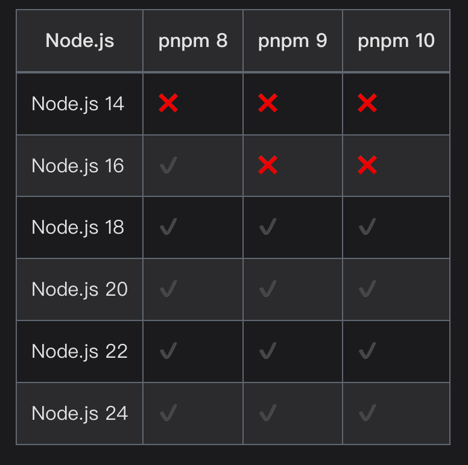

# PNPM 

<!-- https://youtu.be/ZIKDJBrk56k -->
<iframe width="650" height="315" style="margin: 10px auto 0" src="https://www.youtube.com/embed/ZIKDJBrk56k" title="I Finally Changed Package Managers" frameborder="0" allow="accelerometer; autoplay; clipboard-write; encrypted-media; gyroscope; picture-in-picture" allowfullscreen></iframe>

::: info
在现代前端开发中，包管理器是不可或缺的工具。从早期的 npm，到 Yarn、cnpm，再到如今备受推崇的 pnpm，工具的演进始终围绕三个核心诉求：速度、磁盘占用和依赖可靠性。

如果你还在使用 npm 或 Yarn，不妨花 5 分钟了解下 pnpm —— 这个被 Vite、Next.js、Turborepo 等主流工具链官方推荐的“新一代”包管理器，或许会彻底改变你对依赖管理的认知。
:::

## 一、什么是 pnpm？

pnpm（Performant npm）是一个快速、节省磁盘空间且严格可靠的 JavaScript 包管理器。它完全兼容 npm 生态，支持所有标准的 package.json 和 npm registry，但采用了创新的存储机制，从根本上解决了传统包管理器的痛点。

官网：https://pnpm.io  
GitHub Stars：超 28k（截至 2026 年）

## 二、为什么选择 pnpm？四大核心优势

### 1. 极致节省磁盘空间

传统包管理器（如 npm、Yarn）会在每个项目中完整复制依赖包。假设有 10 个项目都用了 lodash@4.17.21，那磁盘上就会有 10 份相同的代码。

而 pnpm 只在全局存储一份 lodash，所有项目通过硬链接（hard link）共享它。这意味着：

- 磁盘占用减少 50%~90%
- 下载速度更快（重复依赖无需重下）
- CI/CD 缓存效率更高

### 2. 安装速度更快

得益于高效的并发下载、智能缓存和增量安装策略，pnpm 在大型项目中的安装速度通常优于 npm 和 Yarn，尤其在重复安装或 CI 环境中优势明显。

### 3. 严格的依赖隔离，杜绝"幽灵依赖"

npm 和 Yarn 默认会将部分依赖"提升"（hoist）到顶层 node_modules，导致你可以意外使用未声明的依赖（称为"幽灵依赖"）。这在本地能跑，换台机器就报错。

pnpm 默认不扁平化依赖树，严格遵循 package.json 声明。只有你显式安装的包才能被引用，大幅提升项目的可重现性和稳定性。

### 4. 原生支持 Monorepo（Workspaces）

如果你在维护一个包含多个子项目的仓库（如组件库 + 应用），pnpm 的 Workspaces 功能可自动链接本地包，无需发布即可跨项目引用，配置简单、运行高效。

## 三、与其他包管理器对比简表

| 特性 | pnpm | npm | cnpm | Yarn |
|-------|-------|-----|------|------|
| 磁盘占用 | ⭐ 极低 | 高 | 高 | 中 |
| 安装速度 | ⭐ 快 | 中 | 快（镜像加速） | 快 |
| 依赖隔离 | ⭐ 严格 | 弱（有幽灵依赖） | 同 npm | Classic 弱，Berry 强 |
| Monorepo 支持 | ⭐ 原生支持 | v7+ 支持 | ❌ | ⭐ 支持 |
| 国内使用体验 | 支持淘宝镜像 | 支持 | 默认淘宝源 | 支持 |
| 学习成本 | 低（命令同 npm） | 最低 | 同 npm | 中 |

💡 cnpm 本质是 npm 的国内镜像客户端，不解决依赖结构问题，仅加速下载。

## 四、快速上手：5 分钟体验 pnpm

::: warning
**<span style="color: red;font-size: 20px">建议 Nodejs 版本 安装 18 以上</span>**
:::



### 第一步：安装 pnpm

推荐使用独立安装脚本（跨平台）：

```bash
curl -fsSL https://get.pnpm.io/install.sh | sh -
```

或通过 npm 安装（需已安装 Node.js）：

```bash
npm install -g pnpm
```

验证安装：

```bash
pnpm -v  # 输出版本号即成功
```

📌 提示：Windows 用户需启用"开发者模式"以支持符号链接（Win10/11 设置中搜索"开发者设置"即可开启）。

### 第二步：创建并运行一个项目

我们用 Vite 创建一个 React + TypeScript 项目（Vite 官方推荐 pnpm）：

创建项目：

```bash
pnpx create-vite my-app -- --template react-ts
```

进入目录：

```bash
cd my-app
```

安装依赖（注意：这里用 pnpm install）：

```bash
pnpm install
```

启动开发服务器：

```bash
pnpm run dev
```

打开浏览器，你将看到熟悉的 Vite 欢迎页 —— 而这一切，都是由 pnpm 驱动的！

### 第三步：常用命令（与 npm 几乎一致）

| 功能 | pnpm 命令 |
|------|-----------|
| 安装依赖 | `pnpm install` |
| 添加依赖 | `pnpm add lodash` |
| 添加开发依赖 | `pnpm add -D typescript` |
| 移除依赖 | `pnpm remove moment` |
| 运行脚本 | `pnpm run build` |
| 查看依赖树 | `pnpm list` |

✅ 所有 `npm xxx` 命令基本可直接替换为 `pnpm xxx`，迁移成本极低。

### 第四步：Monorepo 初体验（可选）

创建一个简单的 Monorepo：

```
my-monorepo/
├── packages/
│   ├── app/
│   └── utils/
├── pnpm-workspace.yaml
└── package.json
```

1. 根目录创建 `pnpm-workspace.yaml`：

```yaml
packages:
  - 'packages/*'
```

2. 在 `packages/utils` 中初始化一个包：

```bash
cd packages/utils
pnpm init
echo 'export const hello = () => "Hello from utils!"' > index.js
```

3. 在 `packages/app` 中引用它：

```bash
cd ../app
pnpm add utils@workspace:*
```

现在 app 就可以直接 `import { hello } from 'utils'` 了！无需发布，自动链接。

## 五、谁在用 pnpm？

- Vite：官方文档明确推荐使用 pnpm
- Next.js / Nuxt：社区模板广泛采用
- Turborepo：官方默认包管理器
- Microsoft、Shopify、GitLab 等企业级项目

## 六、总结：何时该切换到 pnpm？

✅ 强烈推荐使用 pnpm 如果你：

- 同时维护多个前端项目
- 关注构建速度与磁盘空间
- 开发 Monorepo 架构
- 希望避免"在我机器上能跑"的依赖问题

pnpm 不是颠覆者，而是对现有生态的优雅优化。它保留了 npm 的易用性，同时带来了工程化的严谨与效率。

一句话记住 pnpm：

> "一份依赖，处处共享；严格隔离，稳定可靠。"

## 延伸阅读

- [pnpm 官方文档](https://pnpm.io)
- [Why pnpm?](https://pnpm.io/why)
- [Vite + pnpm 最佳实践](https://vite.dev/guide/)

现在，就用 pnpm 初始化你的下一个项目吧！🚀
